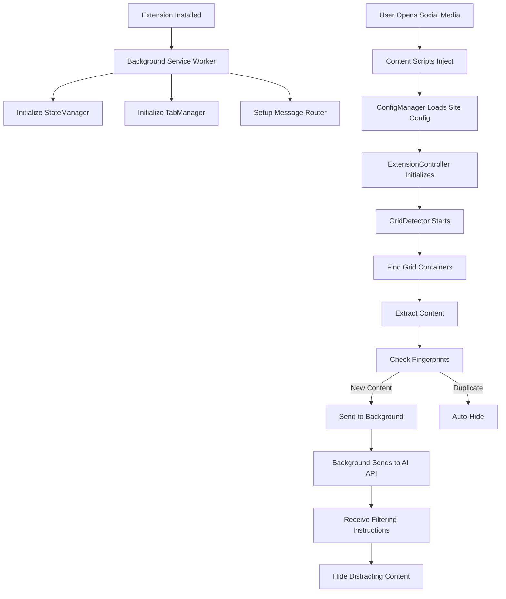

# Topaz Extension Documentation

## Overview

Topaz is a Manifest V3 Chrome extension that provides intelligent, AI-powered content filtering for major social media platforms. It helps users reduce distractions and improve focus by automatically analyzing and filtering content on YouTube, Twitter/X, LinkedIn, and Reddit based on customizable profiles and AI-driven decisions.

## Table of Contents

1. [Features](#features)
2. [Supported Platforms](#supported-platforms)
3. [Architecture Overview](#architecture-overview)
4. [Installation & Setup](#installation--setup)
5. [User Guide](#user-guide)
6. [Technical Documentation](#technical-documentation)
7. [Software Design & Flow](#software-design--flow)
8. [API Integration](#api-integration)
9. [Development Guide](#development-guide)

## Features

### Core Functionality
- **AI-Powered Content Analysis**: Uses machine learning to identify and filter distracting content
- **Real-time Content Filtering**: Analyzes content as you browse without page refreshes
- **Smart Content Detection**: Automatically identifies social media feed structures (grids)
- **Content Fingerprinting**: Remembers previously filtered content to improve performance
- **Visual Feedback**: Blurs content during analysis, then hides or highlights filtered items

### User Modes
- **Simple Mode**: Default mode with pre-configured filtering for each platform
- **Power User Mode**: Advanced mode with custom profile management

### Customization Options
- **Profile System**: Create and manage multiple filtering profiles
- **Whitelist/Blacklist**: Define keywords for content to always show or hide
- **Website-Specific Settings**: Different profiles for different social media platforms
- **Custom Tags**: Add your own filtering rules in Simple Mode (when enabled)

### User Interface
- **Extension Popup**: Central control panel for all settings
- **Block Counter**: Toast notifications showing filtered content count
- **Profile Management**: Easy switching between different filtering profiles
- **Visual Indicators**: Clear feedback on extension status

## Supported Platforms

### YouTube
- Homepage feed
- Search results
- Video recommendations (sidebar)
- Subscription feed

### Twitter/X
- Home timeline
- Explore page
- Search results

### LinkedIn
- Home feed
- Notifications

### Reddit
- Homepage
- Subreddit feeds
- Search results

## Architecture Overview

Topaz follows a modular, event-driven architecture with clear separation between:

### Extension Components

1. **Background Service Worker** (`background/`)
   - Central orchestrator for extension functionality
   - Manages state and communication
   - Handles API requests
   - Coordinates content script activities

2. **Content Scripts** (`content/`)
   - Injected into web pages
   - Detect and analyze page content
   - Apply visual effects
   - Communicate with background

3. **Popup Interface** (`popup/`)
   - User control panel
   - Settings management
   - Profile configuration

### Key Design Patterns

- **Event Bus Pattern**: Decoupled communication between components
- **Manager Pattern**: Specialized managers for different responsibilities
- **Observer Pattern**: DOM mutation observation for dynamic content
- **State Management**: Centralized state with Chrome storage persistence

## Installation & Setup

### For Users

1. **Install from Chrome Web Store** (when published)
   - Navigate to the extension page
   - Click "Add to Chrome"
   - Grant necessary permissions

2. **Manual Installation (Development)**
   ```bash
   # Clone the repository
   git clone [repository-url]
   
   # Navigate to extension directory
   cd topaz-extension
   
   # Load in Chrome:
   # 1. Go to chrome://extensions/
   # 2. Enable "Developer mode"
   # 3. Click "Load unpacked"
   # 4. Select the topaz-extension folder
   ```

### Initial Configuration

1. Click the Topaz icon in Chrome toolbar
2. Choose between Simple Mode or Power User Mode
3. Select or create a profile
4. Start browsing - Topaz will automatically filter content

## User Guide

### Simple Mode (Default)

Simple Mode provides hassle-free filtering with pre-configured settings:

1. **Enable/Disable**: Click the main toggle button
2. **View Stats**: See blocked content count at the bottom
3. **Customize** (Optional):
   - Toggle "Enable Customization"
   - Add custom keywords to block or unblock

### Power User Mode

Access advanced features:

1. **Enable Power User Mode**: Settings → Power User Mode toggle
2. **Profile Management**:
   - Create custom profiles with unique names
   - Set profile-specific whitelists/blacklists
   - Choose which websites each profile applies to
3. **Edit Profiles**: Click "edit" → select profile → modify settings

### Profile System

#### Default Profiles
- Pre-configured for each supported platform
- Optimized filtering rules based on common distractions
- Cannot be deleted (but can be disabled)

#### Custom Profiles
- Create unlimited custom profiles
- Name and color customization
- Website-specific activation
- Full whitelist/blacklist control

## Technical Documentation

### Content Detection System

#### Grid Detection Algorithm
```javascript
1. Scan page for container elements
2. Identify repetitive child structures (social media posts)
3. Validate grid containers:
   - Minimum 2 similar children
   - Sufficient text content
   - Not in ignored elements list
4. Track grids for analysis
```

#### Content Fingerprinting
- **SimHash Algorithm**: 64-bit fingerprints for content similarity
- **Hamming Distance**: Detect near-duplicate content
- **Auto-Delete**: Automatically filter similar content to previously hidden items
- **Performance**: O(1) lookup with minimal memory overhead

### Message Flow

#### Content Analysis Pipeline
```
1. Content Script detects grids
2. Extracts text from grid children
3. Sends to Background for analysis
4. Background queries AI API
5. API returns filtering decisions
6. Background sends hide instructions
7. Content Script applies visual effects
```

### State Management

#### Chrome Storage Structure
```javascript
{
  extensionEnabled: boolean,
  profiles: [
    {
      profileName: string,
      isEnabled: boolean,
      whitelistTags: string[],
      blacklistTags: string[],
      customWhitelist: string[],
      customBlacklist: string[],
      allowedWebsites: string[],
      colour: string,
      isDefault: boolean
    }
  ],
  userSettings: {
    isPowerUserMode: boolean,
    customizationToggle: boolean,
    showBlockCounter: boolean
  }
}
```

## Software Design & Flow

### Extension Initialization Flow



### Component Interactions

#### Background Components

1. **BackgroundController**
   - Main orchestrator
   - Initializes all managers
   - Handles message routing
   - Coordinates API calls

2. **StateManager**
   - Persistent state storage
   - Profile management
   - Settings synchronization
   - Change detection

3. **TabManager**
   - Tab lifecycle management
   - Content script communication
   - Script injection

4. **MessageRouter**
   - Message handler registration
   - Request/response coordination
   - Error handling

5. **HeartbeatManager**
   - Popup lifecycle detection
   - Session management
   - Auto-refresh triggers

#### Content Script Components

1. **ExtensionController**
   - Main content script orchestrator
   - Coordinates all content operations
   - Handles enable/disable states

2. **GridDetector**
   - DOM structure analysis
   - Grid container identification
   - Child element validation

3. **GridManager**
   - Grid state tracking
   - Element organization
   - Update coordination

4. **ContentFingerprint**
   - SimHash generation
   - Duplicate detection
   - Auto-delete decisions

5. **ElementEffects**
   - Visual effect application
   - Blur/hide/highlight operations
   - Animation management

6. **NotificationManager**
   - Toast notifications
   - Block counter display
   - User feedback

7. **DOMObserver**
   - Mutation observation
   - Dynamic content detection
   - Throttled event emission

### Event Flow Examples

#### Initial Page Load
```
1. Content script injection
2. ConfigManager loads site-specific settings
3. GridDetector finds content containers
4. Initial content extraction and fingerprinting
5. API analysis request
6. Apply filtering based on results
7. Start DOM observation for new content
```

#### Dynamic Content Loading
```
1. DOMObserver detects mutations
2. GridManager updates existing grids
3. New content fingerprinted
4. Check for auto-delete matches
5. Send new content for analysis
6. Apply incremental filtering
```

#### Profile Change Flow
```
1. User changes profile in popup
2. StateManager updates storage
3. HeartbeatManager detects popup close
4. Background checks for relevant changes
5. Affected tabs receive disable/enable cycle
6. Content re-analyzed with new profile
```

## API Integration

### Backend Communication

The extension communicates with a backend API service for content analysis:

#### API Endpoints
- `POST /fetch_distracting_chunks`: Analyze content and return filtering decisions

#### Request Format
```javascript
{
  gridStructure: {
    timestamp: string,
    totalGrids: number,
    grids: [{
      id: string,
      gridText: string,
      children: [{
        id: string,
        text: string
      }]
    }]
  },
  currentUrl: string,
  whitelist: string[],
  blacklist: string[]
}
```

#### Response Format
```javascript
[
  {
    gridId: [childId1, childId2, ...] // IDs of children to hide
  }
]
```

### Chunking Strategy
- Large grids split into chunks (configurable size)
- Parallel API requests for performance
- Results combined before applying

## Development Guide

### Project Structure
```
topaz-extension/
├── manifest.json          # Extension manifest
├── background/           # Background service worker
│   ├── background.js    # Entry point
│   ├── core/           # Core components
│   ├── managers/       # State, tab, message management
│   ├── api.js         # API communication
│   └── utils/         # Utilities
├── content/            # Content scripts
│   ├── index.js       # Entry point
│   ├── core/          # Core controllers
│   ├── grid/          # Grid detection/management
│   ├── ui/            # Visual effects
│   ├── observers/     # DOM observation
│   ├── messaging/     # Background communication
│   └── config.json    # Site configurations
├── popup/             # Extension popup
│   ├── popup.html    # UI structure
│   ├── popup.js      # Main logic
│   ├── ui.js         # UI rendering
│   ├── state.js      # State management
│   └── background-api.js # Background communication
└── shared/           # Shared constants
```

### Key Development Considerations

1. **Load Order**: Content scripts must load in specific order (see manifest.json)
2. **Event-Driven**: Use EventBus for decoupled communication
3. **State Consistency**: Always sync state through StateManager
4. **Error Handling**: Graceful degradation for API failures
5. **Performance**: Throttle DOM observations, batch API requests

### Testing Guidelines

1. **Manual Testing**:
   - Test on all supported platforms
   - Verify profile switching
   - Check dynamic content handling
   - Validate visual effects

2. **Debug Tools**:
   - Chrome DevTools for content scripts
   - Service Worker inspector for background
   - Console logs prefixed by component

3. **Common Issues**:
   - Content script injection timing
   - State synchronization delays
   - API rate limiting
   - DOM structure variations

### Future Enhancements

1. **Additional Platforms**: Support for more social media sites
2. **Advanced AI Models**: Improved content analysis
3. **Performance Optimization**: Faster fingerprinting algorithms
4. **User Analytics**: Anonymous usage statistics
5. **Sync Across Devices**: Cloud profile synchronization